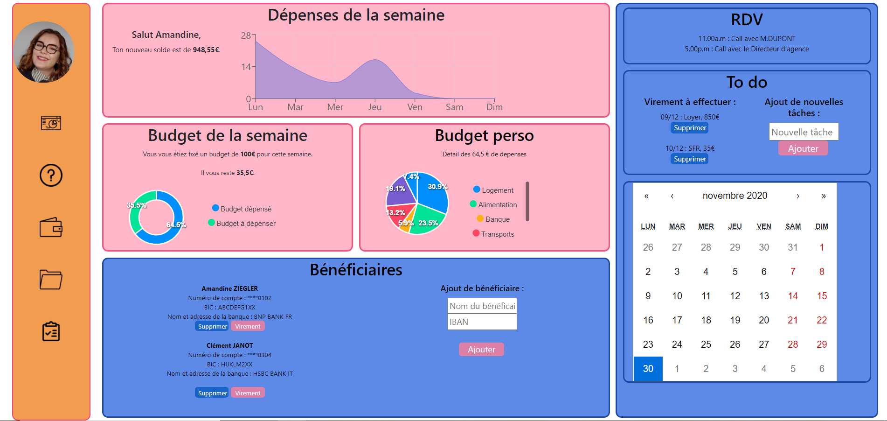

<h1>Projet de fin de semestre</h1>

Clément Janot & Amandine Ziegler

<h3>Description du projet : </h3> 
Nous avons réalisé un dashboard pour un suivi financier à usage personnel. 
Notre dashboard se compose d'un suivi des dépenses, d'une liste des bénéficaires de virements, d'une répartition des dépenses, d'un calendrier avec suivi des meeting du jour et des virements à effectuer et d'un suivi des objectifs hebdomaires fixés.

<h3>Notre wireframe sur figma:</h3>

<h3>Lancer le projet :</h3> 
Pour pouvoir lancer le projet il vous faudra installer npm.  
Poue cela : 
1/ Cloner le projet  
2/ Installer npm avec la commande suivante dans /frontend 
    - npm install 
3/ Par la suite, lancer le projet:  
    - npm start 
   
<h3>Rendu du dashboard:</h3>

<h3>Problèmes rencontrés : </h3> 
- Mise en commun des widgets que l'on a codé séparemment avec bootstrap et css.  
- Adaptation du dashboard en fonction de l'écran PC, tablette, téléphone.  
- Connecter le calendrier aux meeting et à la todo liste. 
- Problème de responsivité avec la barre de navigation 

Trello : https://trello.com/web26241426

<h3>Sources :</h3> 
- https://reactheure.fr/creer-une-todo-list-en-react-js-fin-%F0%9F%8E%89/?cli_action=1606039549.47  
- https://medium.com/how-to-react/create-a-calendar-in-react-js-e48e43ab3a19  
- https://git-scm.com/book/fr/v2/Les-branches-avec-Git-Branches-et-fusions%C2%A0%3A-les-bases  
- https://recharts.org/en-US/examples  
- https://fr.reactjs.org/  
- https://apexcharts.com/react-chart-demos/pie-charts/  

<h4>Auteurs</h4> 
Amandine Ziegler / Clément Janot TD4B
